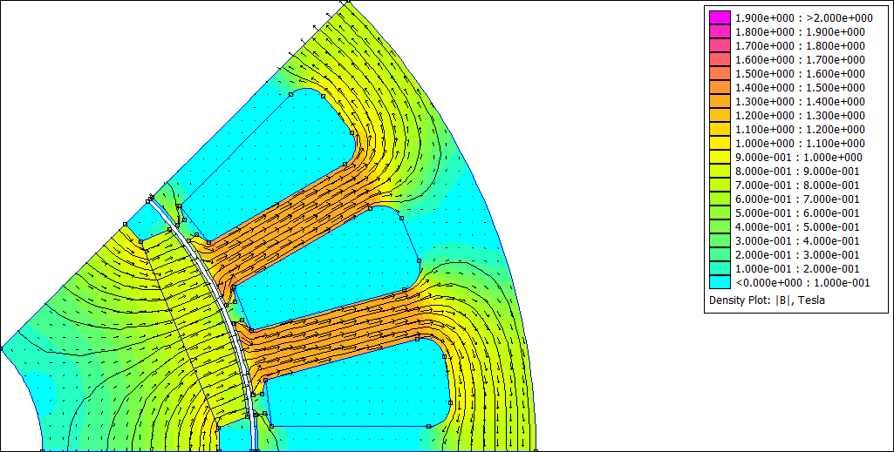
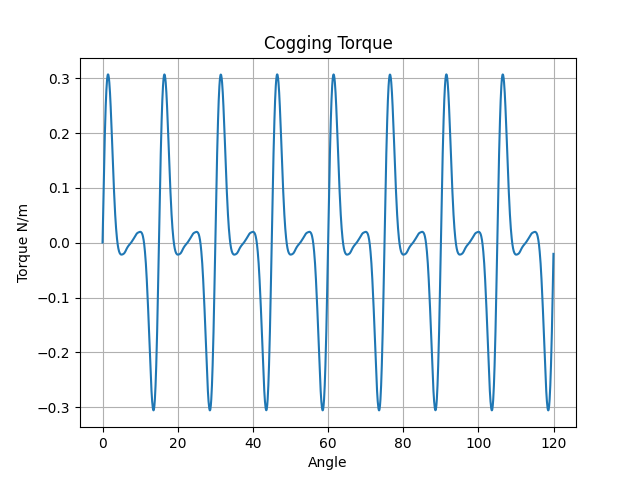
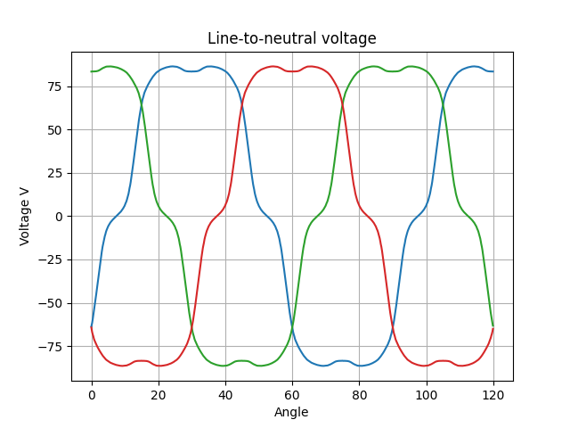

# Rotor Motion FEMM 4.2 example with pyFEMM
A simple example of a section of a permanent magnet generator from FEMM 4.2 wiki rewritten in pyFEMM

[FEMM 4.2](https://www.femm.info/wiki/HomePage)

[Rotor Motion example](https://www.femm.info/wiki/RotorMotion#)

[pyFEMM manual](https://www.femm.info/wiki/pyFEMM/manual.pdf)

### Flux density animation

### Cogging torque

### Line-to-neutral voltage

